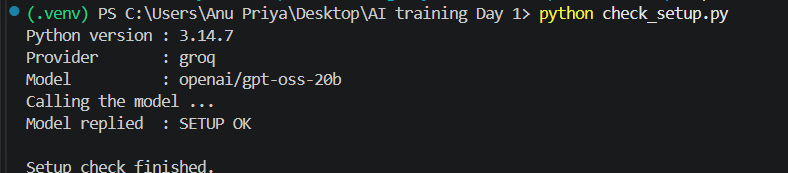
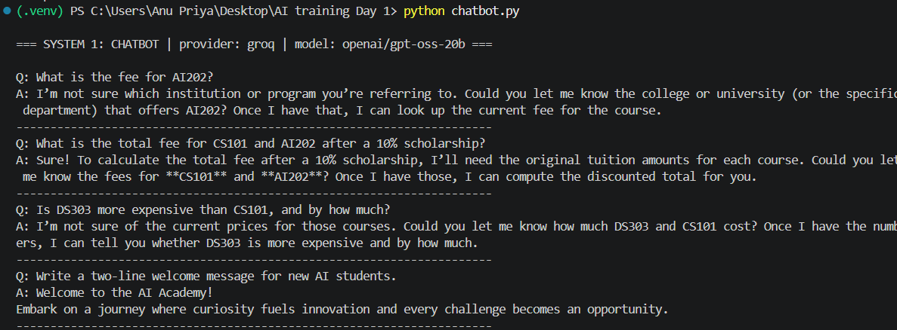
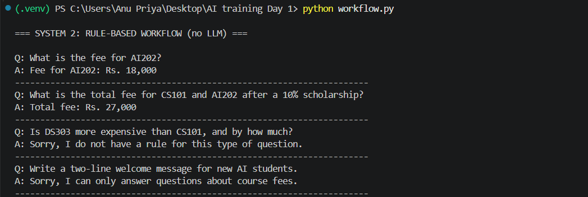
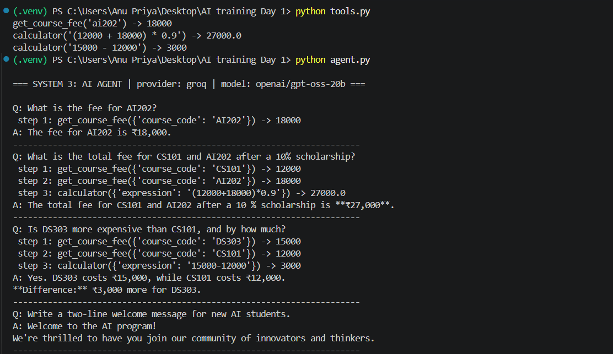
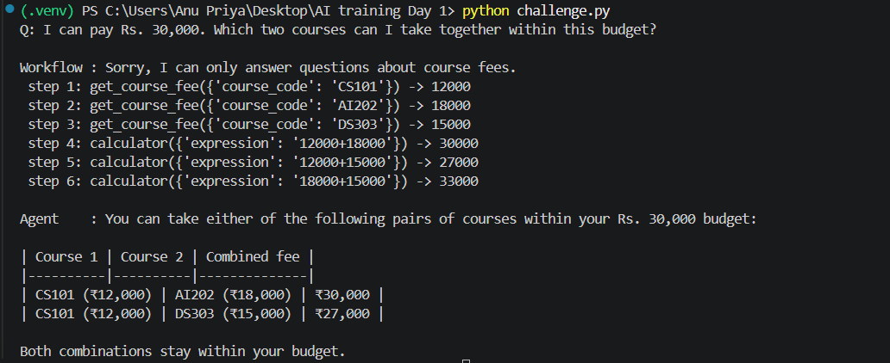

# AI-Fluency-Training-7376242IT116
AI fluency training DAY 1 lab - Chatbot vs Rule-Based Workflow vs AI Agent
# AI Fluency Training – Day 1

## 1. Project Overview

This project demonstrates three different approaches to answering questions about private college course-fee data:

1. **Chatbot** – sends the question directly to an LLM.
2. **Rule-Based Workflow** – uses predefined Python rules without an LLM.
3. **AI Agent** – allows the LLM to decide when to use tools such as fee lookup and calculation.

The project also includes a challenge task to test how the different systems handle a new type of request.

---

## 2. Problem Statement

The college has private course-fee information that should not be guessed by an AI model.

### Course Fee Data

| Course Code | Fee |
|---|---:|
| CS101 | Rs. 12,000 |
| AI202 | Rs. 18,000 |
| DS303 | Rs. 15,000 |

The systems were tested using the following questions:

1. What is the fee for AI202?
2. What is the total fee for CS101 and AI202 after a 10% scholarship?
3. Is DS303 more expensive than CS101, and by how much?
4. Write a two-line welcome message for new AI students.

---

## 3. Systems Implemented

### System 1 – Chatbot

The chatbot sends the user's question directly to the LLM.

**Flow:**

```text
User Question
      ↓
     LLM
      ↓
   Answer
```

It does not have direct access to the private course-fee data.

---

### System 2 – Rule-Based Workflow

The workflow uses Python rules and the stored course-fee dictionary.

**Flow:**

```text
User Question
      ↓
Extract Course Codes
      ↓
Apply Python Rules
      ↓
Calculate Result
      ↓
   Answer
```

It does not use an LLM.

---

### System 3 – AI Agent

The AI agent uses the LLM to decide whether a tool is required.

Available tools:

- `get_course_fee` – retrieves the fee for a course.
- `calculator` – performs arithmetic calculations.

**Flow:**

```text
User Question
      ↓
     LLM
      ↓
Does it need a tool?
   ↙          ↘
 Yes           No
  ↓             ↓
Call Tool    Final Answer
  ↓
Observe Result
  ↓
LLM decides next action
  ↓
Final Answer
```

This follows a **Reason → Act → Observe → Repeat** pattern.

---

## 4. Tools Used

### `get_course_fee`

Looks up the fee for a course code.

Example:

```text
get_course_fee("AI202")
→ 18000
```

### `calculator`

Performs arithmetic safely using supported mathematical operations.

Example:

```text
calculator("(12000 + 18000) * 0.9")
→ 27000
```

---

## 5. Agent Trace – Question 2

**Question:**

> What is the total fee for CS101 and AI202 after a 10% scholarship?

The agent needs both course fees and then performs the calculation.

| Step | Tool / Action | Observation |
|---|---|---|
| 1 | `get_course_fee("CS101")` | 12000 |
| 2 | `get_course_fee("AI202")` | 18000 |
| 3 | `calculator("(12000 + 18000) * 0.9")` | 27000 |
| 4 | Final answer | Rs. 27,000 |

The calculation is:

```text
12000 + 18000 = 30000
10% scholarship = 3000
Final fee = 27000
```

---

## 6. Observations

| Criterion | Chatbot | Workflow | Agent |
|---|---|---|---|
| Q1 correct? | No* | Yes | Yes |
| Q2 correct? | No* | Yes | Yes |
| Q3 correct? | No* | No | Yes |
| Q4 handled well? | Yes | No | Yes |
| Challenge question handled? | See challenge output | See challenge output | See challenge output |
| Same output on repeat run? | Depends on LLM | Yes | Depends on LLM/tool decisions |
| Approximate response time | Depends on LLM/API | Very fast | Depends on LLM/tool calls |
| Number of LLM calls per question | 1 | 0 | Multiple when tools are required |
| Strength | Good for general conversation | Predictable and fast | Can dynamically use tools |
| Weakness | Cannot directly access private course data | Limited to predefined rules | More complex and depends on LLM/tool calling |

\*The chatbot does not have access to the private course-fee dictionary, so numerical answers may be incorrect or guessed.

---

## 7. Comparison

| Feature | Chatbot | Rule-Based Workflow | AI Agent |
|---|---|---|---|
| Uses LLM | Yes | No | Yes |
| Uses private fee data | No | Yes | Yes |
| Uses tools | No | No | Yes |
| Handles calculations | LLM-generated | Python | Calculator tool |
| Dynamic decision making | Limited | No | Yes |
| Flexibility | High for general questions | Low | High |
| Predictability | Depends on LLM | High | Depends on LLM/tool calls |

---

## 8. Project Structure

```text
AI training Day 1/
│
├── agent.py
├── chatbot.py
├── challenge.py
├── check_setup.py
├── config.py
├── tools.py
├── workflow.py
├── requirements.txt
├── README.md
├── .gitignore
│
└── screenshots/
    ├── check_setup.png
    ├── chatbot.png
    ├── workflow.png
    ├── tool_agent.png
    └── challenge.png
```

---

## 9. Screenshots











---

## 10. Key Learning

This exercise demonstrates the difference between a simple LLM chatbot, a deterministic rule-based workflow, and a tool-using AI agent.

The main learning is that an LLM should not be expected to know or guess private data. Instead, an agent can connect the LLM to reliable tools that retrieve the required data and perform calculations.

The agent therefore combines:

```text
LLM
 +
Private Data
 +
Tools
 =
Tool-Using AI Agent
```

---

## 11. Security

The Groq API key is stored in a `.env` file and is excluded from Git using `.gitignore`.

The following files/folders are ignored:

```text
.env
.venv/
__pycache__/
*.pyc
```

The API key should never be committed to GitHub.

---

## 12. Conclusion

The three systems demonstrate different approaches to solving the same problem.

The **chatbot** is useful for general conversational tasks but cannot reliably access private course data.

The **rule-based workflow** provides predictable results for predefined cases but has limited flexibility.

The **AI agent** combines an LLM with tools, allowing it to retrieve private data and perform calculations dynamically.

This project demonstrates the basic architecture and working principle of a **tool-using AI agent**.
